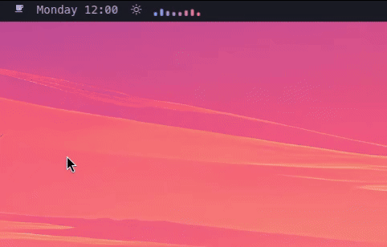
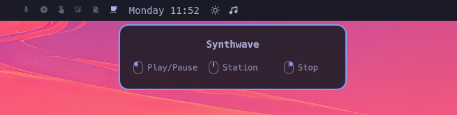
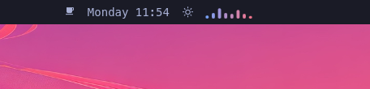

# Lofi Radio for Omarchy

Continuous Lofi Hip Hop and Synthwave radio in the Omarchy Quattro bar, with
headless playback and a live, theme-aware equalizer.



| Ready | Playing in the bar |
| --- | --- |
|  |  |

This project is unofficial and is not affiliated with Omarchy, YouTube, or
Lofi Girl. Stream availability and rights remain with their respective owners.

## Features

- Audio-only playback with no video window
- Clear playing, paused, idle, and error states in the bar
- Inline and hover equalizers driven by the actual PipeWire output
- Configurable 15–120 FPS visualizer (60 FPS by default)
- Play/pause, station switching, and stop controls
- Single-player locking and private per-user runtime files
- Continuous playback through YouTube's official player in headless Chromium
- YouTube Premium support through a dedicated, persistent Chromium profile
- Desktop notifications for invalid settings and missing dependencies
- Runtime diagnostics in `$XDG_RUNTIME_DIR/espi-lofi-radio-$UID/chromium.log`

## Requirements

- Omarchy Quattro
- `chromium`
- `cava`
- `flock` and `install` from standard Arch packages (`util-linux`, `coreutils`)

The plugin never requests elevated privileges or installs packages itself.

Install the required packages if they are not already present:

```sh
omarchy pkg add chromium cava
```

## YouTube Premium

Sign in once using the plugin's isolated Chromium profile:

```sh
~/.config/omarchy/plugins/espi.lofi-radio/control.sh login
```

Complete the YouTube sign-in in the window that opens, then close that window.
Future headless playback uses the same profile, so your Premium membership is
recognized without sharing your normal browser profile with the plugin.

## Install

```sh
omarchy plugin add https://github.com/JovannyEspinal/omarchy-lofi-radio.git --enable
```

## Controls

- Left click: start or play/pause
- Middle click: switch between **Lofi Hip Hop** and **Synthwave**
- Right click: stop playback

Playback uses YouTube's official Chromium player with the dedicated profile.

## Validate

```sh
omarchy plugin validate .
qmllint -I "$OMARCHY_PATH/shell" BarWidget.qml
bash -n control.sh
shellcheck control.sh
```

## Remove

```sh
omarchy plugin remove espi.lofi-radio
```

Stopping the plugin before removal is recommended. Runtime files live under
`$XDG_RUNTIME_DIR` and disappear automatically at logout or reboot. The
isolated YouTube login remains in `$XDG_STATE_HOME/espi-lofi-radio` (or
`~/.local/state/espi-lofi-radio`) until you remove it manually.

## License

MIT. See `LICENSE`.
